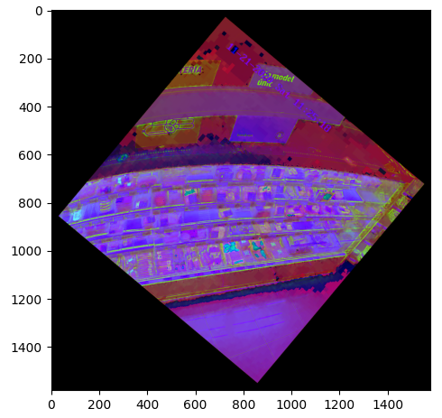
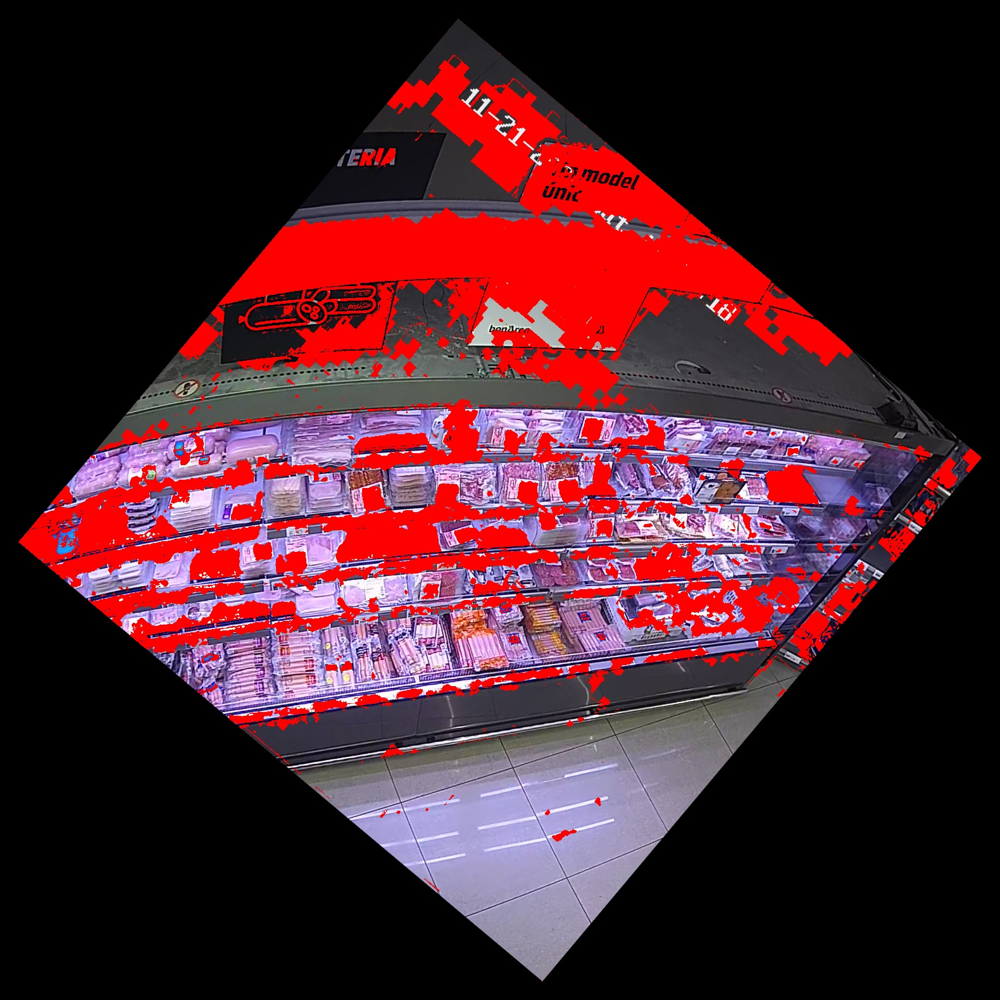

**EQUIPO: GEIADE HACKERS 😎**

**PARTICIPANTES: ISAAC TORRES ESPUÑA, JORDI ARENAS ROMERO, DIEGO VÁZQUEZ TEBA**

**Objetivo del reto:** El objetivo del reto es mejorar el abastecimiento de carne en el lineal de frío. Para ello es necesario crear un programa capaz de detectar la falta de producto en el lineal y su consiguiente reposición.

**Procedimiento para crear el programa:**

**1. Brainstorming**

El primer paso ha sido pensar diferentes ideas mediante las cuales el programa pudiese detectar los huecos del lineal. De todas ellas hemos decidido que la más acertada era analizar los huecos según su color. Para ello hemos definido que, como el fondo es blanco y, por lo general, el producto es rojo o rosado, si la mayoría de la zona corresponde a ese color significa que hay un hueco.

**2. Determinar la zona de análisis**

Para facilitar el análisis por zonas hemos dividido el lineal en diferentes casillas, cada una correspondiente a un tipo de carne diferente. En total hay 80 casillas.

A continuación hemos asignado unas coordenadas a cada casilla con tal de, posteriormente, introducirlas en el código del programa. Se encuentran en los archivos.

**3. Empezar a programar**

Una vez hemos localizado cada casilla, empezamos a programar. El lenguaje de programación usado ha sido Python 3.

Hemos creado un sistema capaz de, a partir del color, aislar las zonas donde predomina el blanco con tal de detectar posibles huecos. Para ello hemos asignado una condición requerida con tal de identificar cada casilla como posible hueco. Esta condición consiste en que la zona tenga, como mínimo, un total de 74% del color que hemos definido en un rango de blancos.

En caso de que esta condición se cumpla en unas determinadas coordenadas correspondientes a una casilla, detectará esta como hueco y lo indicará una vez finalizado el proceso de análisis de cada casilla.

**4. Nueva condición**

Hemos implementado en el programa una función que en caso de detectar a una persona delante del lineal, omite el proceso de detección de huecos para evitar errores y no enviar información equivocada. Esta detección se realiza mediante un modelo de tenserflow entrenado con las imágenes que se han facilitado (una especie de inteligencia artificial simple) generada con _teachablemachines.withgoogle.com_ y exportada como modelo keras. Se puede encontrar en el archivo _keras\_model.h5._

El modelo facilita como salida el porcentaje de seguridad que tiene según si hay un obstáculo o no (parece que funciona de manera correcta aunque se tendría que realizar un entrenamiento más exhaustivo con otras imágenes).

El programa también detecta si los lineales se encuentran cerrados y no realiza ninguna comprobación en ese caso.

**5. Funcionamiento del programa:**

1. Normalización de la imagen para detectar obstáculos delante del lineal (reducción del tamaño original).

En caso de haber obstáculos se informa de ello al usuario y no se tomará nunguna otra opción, en caso contráreo:

2. Normalización de la imagen y tratamiento mediante OpenCV. (Eliminación de las partes innecesarias de la imágen, añadir bordes de color negro al lienzo para poder realizar la rotación sin perdida de información, rotación de la imagen para facilitar el tratamiento de los espacios individuales, Cambio del _workspace_ del color de BRG a HSV). Resultado tras la normalización:

3. Tratamiento de la imagen. Se crea una máscara de la imagen normalizada según los espacios en blanco, esto se realiza mediante el análisis de todos los colores dentro de un rango definido dentro del programa (permite la calibración para distintos entornos con tan solo la modificación de estos valores). Resultado de la aplicación de la máscara (Roja) encima de la imagen:

4. Segmentación y análisis. Disponiendo de la máscara con la que vamos a trabajar se divide en distintas partes correspondientes a cada compartimento de los productos, aquí se analiza el porcentaje de máscara según la cantidad de píxeles de esa región y se obtiene un porcentaje. Hemos determinado que el porcentaje de máscara óptimo para determinar que falta un producto es del 74%.

5. En el caso de detectar una variación de los valores en referencia a la anterior comprobación se envía un aviso por pantalla (podría adaptarse fácilmente para mostrar información a un dispositivo externo) .

El sistema no requiere mucho poder computacional, ya que realiza operaciones básicas sobre imágenes y un modelo muy simple se encarga de analizar si hay obstáculos delante del lineal. Podría ser implementado en casi cualquier dispositivo con un coste muy reducido (por ejemplo Raspberry Pi)

**6. Pruebas de funcionamiento**

Tras la programación del sistema procedemos a comprobar su correcto funcionamiento, después de realizar las calibraciones de color oportunas, se puede determinar su correcto funcionamiento.

**7. Propuestas de mejora**

Los resultados fueron considerablemente buenos teniendo en cuenta la disposición de los productos, cámara, etc. Aún así, llegamos a la conclusión de que estos serían más precisos si se implementaran las siguientes mejoras:

Mejoras del sistema:

- Se ajusta la posición de la cámara: Al estar tan esquinada, se pierde la visión de algunas zonas y consecuentemente impide al programa analizar al 100% la casilla.
- En la fila inferior se pueden ocasionar errores ya que el color del fondo del refrigerador es muy parecido al de los productos y, aunque se podría implementar una corrección para esa zona, sería más sencillo y efectivo poner la base con el color blanco, igual que en las otras filas del lineal
- Se podrían obtener unos resultados mucho más optimizados si para el fondo se usara un color menos frecuente y con menos reflejos que el blanco como por ejemplo un verde o azul croma. Esta sería la mejora más importante y se podría implementar de manera sencilla al programa realizando un cambio de los valores asignados al rango de colores
- Utilización de un sistema de códigos (por ejemplo códigos QR) para detectar con exactitud la casilla que se encuentra vacía y poder informar de manera mucho más precisa.

Mejoras del programa:

- Realizar una interfaz para el usuario con el propósito de poder configurar de manera más sencilla las casillas de cada una de las líneas.
